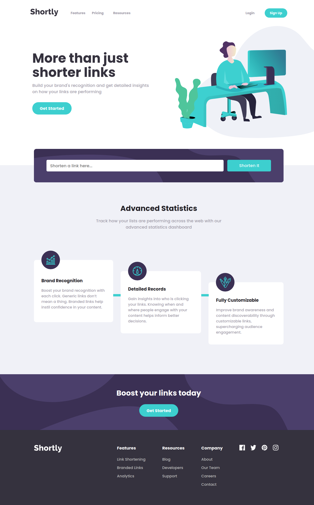

# Frontend Mentor - Shortly URL Shortening API Challenge solution

This is a solution to the [Shortly URL shortening API Challenge challenge on Frontend Mentor](https://www.frontendmentor.io/challenges/url-shortening-api-landing-page-2ce3ob-G). Frontend Mentor challenges help you improve your coding skills by building realistic projects.

## Table of contents

- [Overview](#overview)
  - [The challenge](#the-challenge)
  - [Screenshot](#screenshot)
  - [Links](#links)
- [My process](#my-process)
  - [Built with](#built-with)
  - [What I learned](#what-i-learned)
  - [Continued development](#continued-development)
  - [Useful resources](#useful-resources)
- [Author](#author)

## Overview

### The challenge

Users should be able to:

- View the optimal layout for the site depending on their device's screen size
- Shorten any valid URL
- See a list of their shortened links, even after refreshing the browser
- Copy the shortened link to their clipboard in a single click
- Receive an error message when the `form` is submitted if:
  - The `input` field is empty

### Screenshot



### Links

- Solution URL: <https://github.com/Ocholla-T/shortly>
- Live Site URL: <https://shortly-ochollat.netlify.app/>

## My process

### Built with

- Semantic HTML5 markup
- Flexbox
- Mobile-first workflow
- [VueJs](https://vuejs.org/) - JS library
- [VueX](https://vuex.vuejs.org/) - State management pattern and library
- [SCSS](https://sass-lang.com/) - For styles

### What I learned

How to work with slots to create reusable html components elements. Style once, Pass down content using named slots.

```html
<template>
  <div class="shorten flex">
    <p>
      <slot name="original-link" />
    </p>
    <hr />
    <p ref="shortenedLink">
      <slot name="shortened-link" />
    </p>
    <a ref="copyButton" @click="copyLink">Copy</a>
  </div>
</template>
```

Opening and closing of the hamburger menu on mobile was a masterclass on my part :satisfied:

```css
.open {
  > span:first-child {
    transform: rotate(45deg);
  }

  > span:nth-child(2) {
    opacity: 0;
  }

  > span:last-child {
    transform: rotate(-45deg);
  }
}
```

### Continued development

- Get to work more with animations
- Write more markdown on other projects

### Useful resources

- [vuex-persistedstate](https://www.npmjs.com/package/vuex-persistedstate) - This NPM package helped me persist shortened links through the use of cookies. Made it easier to do.

**Note: Delete this note and replace the list above with resources that helped you during the challenge. These could come in handy for anyone viewing your solution or for yourself when you look back on this project in the future.**

## Author

- Frontend Mentor - [@Ocholla-T](https://www.frontendmentor.io/profile/Ocholla-T)
- LinkedIn - [Ocholla Tonny](https://www.linkedin.com/in/ochollatonny)
